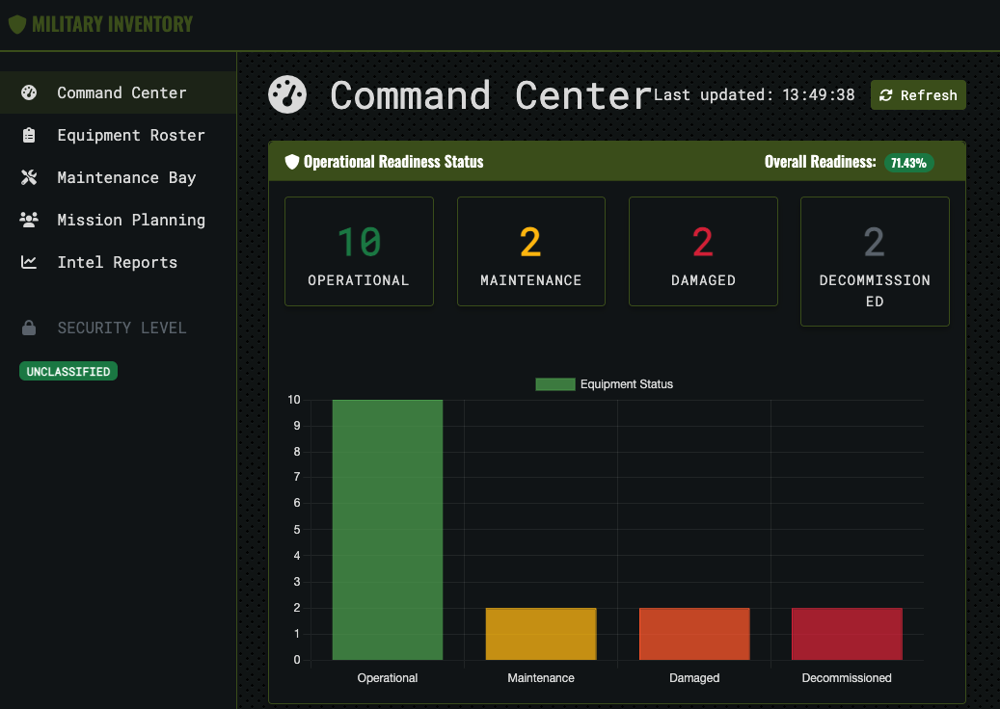
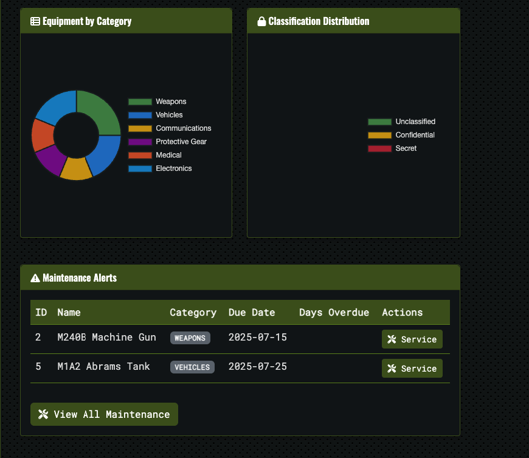
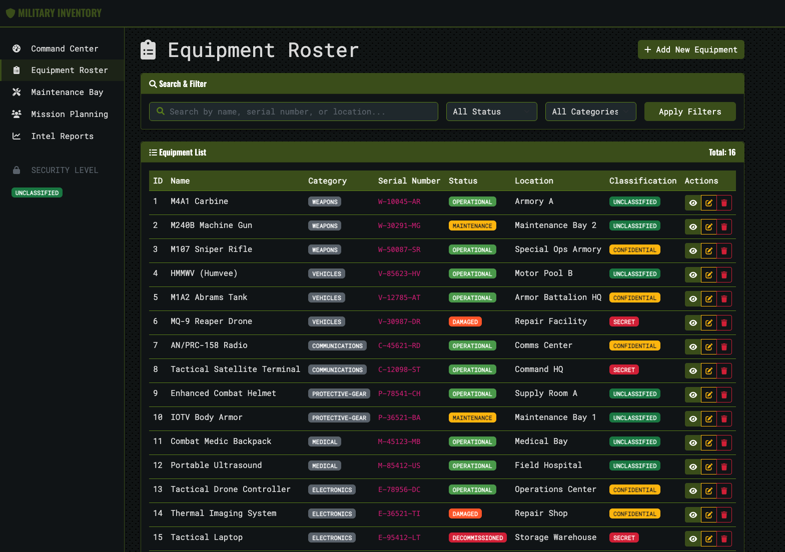
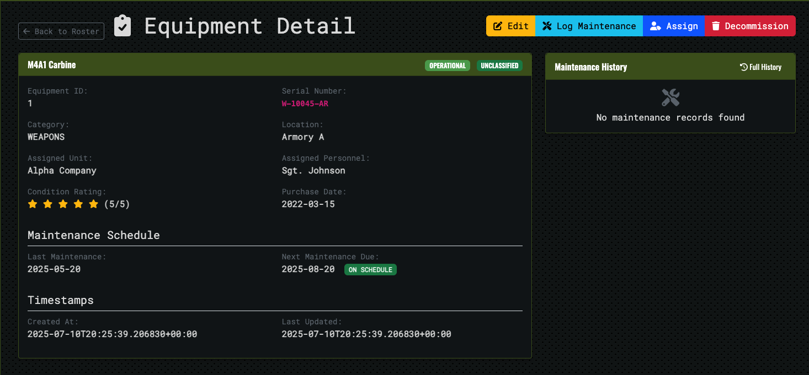
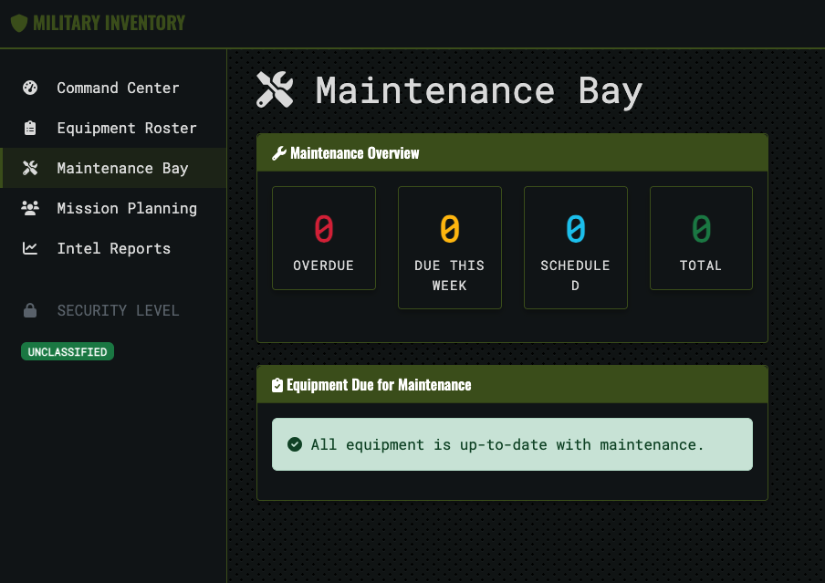
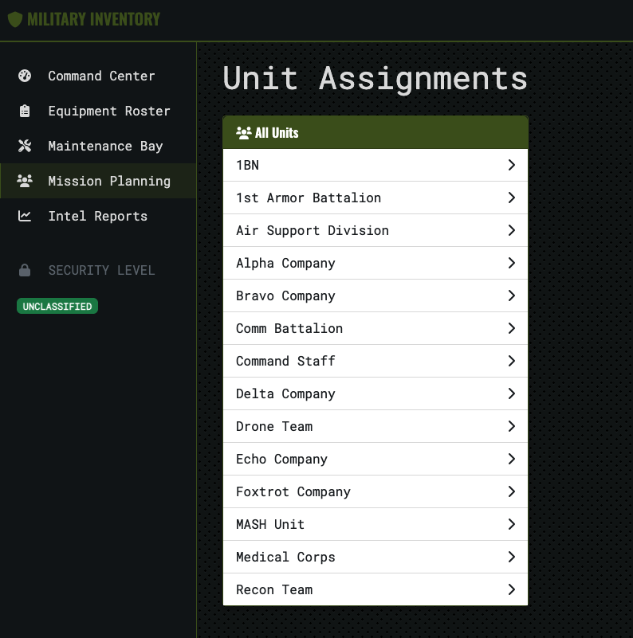

# Military Equipment Inventory System

A comprehensive multi-container application for managing military equipment inventory, maintenance schedules, and unit assignments.


## ⚠️ Important Disclaimer

**This application is built for learning and demonstration purposes only, specifically to showcase container technologies and container orchestration concepts. It should NOT be used in production environments as it may contain security vulnerabilities and is not hardened for real-world deployment.**

This project serves as an educational tool for understanding:
- Multi-container application architecture
- Docker and Docker Compose workflows
- Container orchestration principles
- Modern web application development patterns

## Overview

The Military Equipment Inventory System is a robust platform designed for military organizations to efficiently track, manage, and maintain their equipment inventory. The system features a tactical-styled interface with military-grade security measures and comprehensive equipment management capabilities.

### Command Center Dashboard


The main command center provides a comprehensive overview of your equipment inventory with real-time status updates and operational readiness indicators.



### Key Features

- **Command Dashboard**: Military-styled overview with operational readiness status
- **Equipment Roster**: Complete inventory listing with search and filtering
- **Maintenance Tracking**: Schedule and log equipment maintenance activities
- **Unit Assignment**: Track equipment assignments to units and personnel
- **Classification Handling**: Support for different security classification levels
- **Readiness Reports**: Monitor equipment availability and operational status

## Architecture

The system is built using a modern multi-container architecture:

- **Web App**: Django frontend with military-themed UI
- **API Service**: FastAPI backend for equipment CRUD operations
- **Database**: PostgreSQL for persistent data storage
- **Cache**: Redis for performance optimization

### Technology Stack

- **Frontend**: Django, Bootstrap, FontAwesome, jQuery
- **Backend API**: FastAPI, Pydantic, SQLAlchemy
- **Database**: PostgreSQL
- **Cache**: Redis
- **Containerization**: Docker, Docker Compose

## Getting Started

### Prerequisites

- Docker and Docker Compose
- Git

### Installation

1. Clone the repository:
   ```bash
   git clone https://github.com/yourusername/military-equipment-inventory.git
   cd military-equipment-inventory
   ```

2. Start the application using Docker Compose:
   ```bash
   docker-compose up -d
   ```

3. Access the web interface:
   ```
   http://localhost:8000
   ```

4. Access the API documentation:
   ```
   http://localhost:8001/docs
   ```

### Environment Variables

Create a `.env` file in the project root with the following variables:

```
# Database Configuration
POSTGRES_USER=postgres
POSTGRES_PASSWORD=postgres
POSTGRES_DB=equipment_inventory
POSTGRES_HOST=database
POSTGRES_PORT=5432

# Redis Configuration
REDIS_HOST=cache
REDIS_PORT=6379

# API Service
API_HOST=api_service
API_PORT=8001

# Web App
DEBUG=False
SECRET_KEY=your_secret_key_here
ALLOWED_HOSTS=localhost,127.0.0.1
```

## Usage

### Equipment Management



- **View Equipment**: Browse all equipment in the inventory from the Equipment Roster
- **Add Equipment**: Add new equipment with details like name, category, status, etc.
- **Edit Equipment**: Update equipment details, status, and assignments
- **Decommission Equipment**: Mark equipment as decommissioned when no longer in service

#### Equipment Details


Access detailed information for each piece of equipment including specifications, maintenance history, and current assignment status.

### Maintenance Operations



- **Schedule Maintenance**: Set up regular maintenance schedules for equipment
- **Log Maintenance**: Record maintenance activities with details and timestamps
- **View History**: Access complete maintenance history for any equipment item

The maintenance bay interface provides a comprehensive view of all maintenance activities, schedules, and equipment status updates.

### Unit Assignment



- **Assign Equipment**: Assign equipment to specific military units
- **Personnel Tracking**: Track which personnel are responsible for equipment
- **Unit View**: View all equipment assigned to a particular unit

The unit assignment interface allows for efficient tracking and management of equipment distribution across different military units and personnel.

## API Endpoints

The system provides a comprehensive RESTful API:

- `GET /equipment` - List all equipment with pagination and filtering
- `GET /equipment/{id}` - Get specific equipment details
- `POST /equipment` - Create new equipment entry
- `PUT /equipment/{id}` - Update equipment status/details
- `DELETE /equipment/{id}` - Decommission equipment
- `GET /equipment/search` - Search equipment by name/category/serial
- `GET /equipment/stats` - Get inventory statistics and readiness reports
- `GET /equipment/maintenance` - Get maintenance schedule and overdue items
- `GET /equipment/unit/{unit_id}` - Get equipment by assigned unit

## Development

### Project Structure

```
military-equipment-inventory/
├── api_service/            # FastAPI backend service
│   ├── alembic/            # Database migrations
│   ├── crud/               # CRUD operations
│   ├── db/                 # Database models and connection
│   ├── schemas/            # Pydantic schemas
│   ├── utils/              # Utility functions
│   └── main.py             # FastAPI application
├── web_app/                # Django frontend application
│   ├── equipment/          # Equipment management app
│   ├── static/             # Static files (CSS, JS)
│   └── templates/          # HTML templates
├── docker-compose.yml      # Docker Compose configuration
├── .env                    # Environment variables
└── README.md               # Project documentation
```

### Future Kubernetes Deployment

While the system currently uses Docker Compose for local development, a Kubernetes deployment is planned for production environments to enhance scalability and resilience:

1. **Kubernetes Resources**:
   - Deployments for web app, API service, and database
   - Services for internal communication
   - Ingress for external access
   - ConfigMaps and Secrets for configuration

2. **Scaling Capabilities**:
   - Horizontal Pod Autoscaling for the web app and API service
   - Resource limits and requests for optimal cluster utilization
   - StatefulSet for database with persistent volumes

3. **CI/CD Integration**:
   - Automated deployment pipeline with GitHub Actions
   - Helm charts for package management
   - Blue/Green deployment strategy for zero-downtime updates

## Troubleshooting

### Common Issues

1. **Container Connection Issues**:
   - Ensure all containers are running: `docker-compose ps`
   - Check container logs: `docker-compose logs [service_name]`

2. **Database Connection Errors**:
   - Verify PostgreSQL is running: `docker-compose logs database`
   - Check database connection settings in `.env` file

3. **API Errors**:
   - Check API logs: `docker-compose logs api_service`
   - Verify API endpoints using Swagger UI: `http://localhost:8001/docs`

## License

This project is licensed under the MIT License - see the LICENSE file for details.

## Contributing

Contributions are welcome! Please feel free to submit a Pull Request.

1. Fork the repository
2. Create your feature branch (`git checkout -b feature/amazing-feature`)
3. Commit your changes (`git commit -m 'Add some amazing feature'`)
4. Push to the branch (`git push origin feature/amazing-feature`)
5. Open a Pull Request

---

Developed with ❤️ for military logistics and equipment management.
